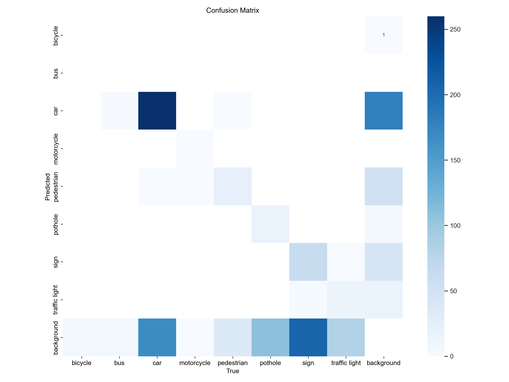
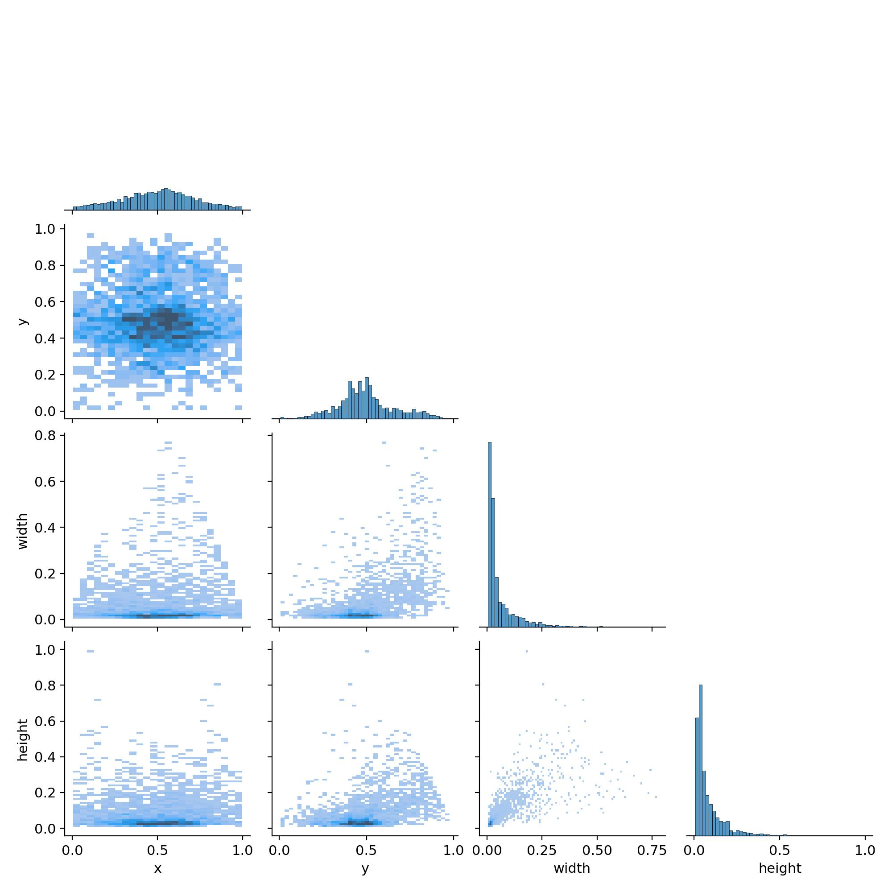
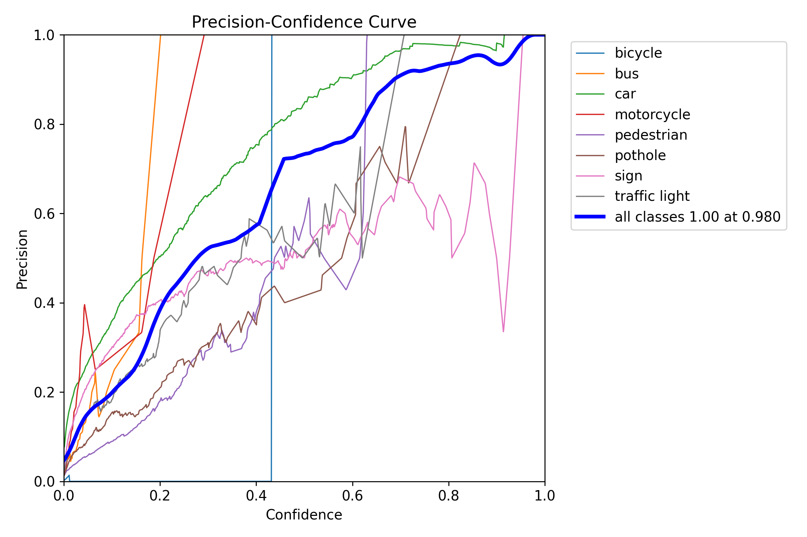
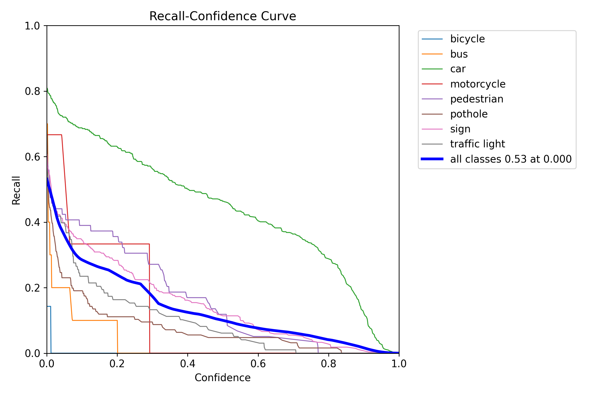
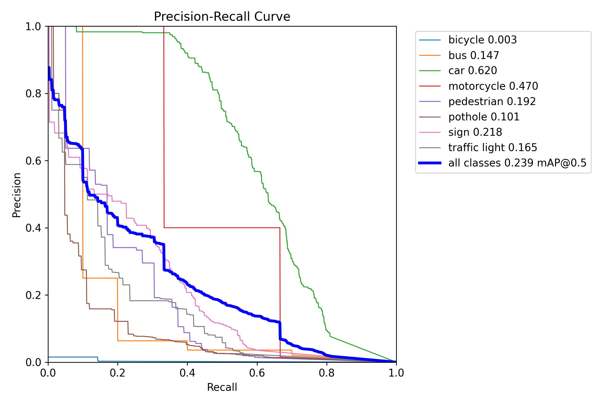
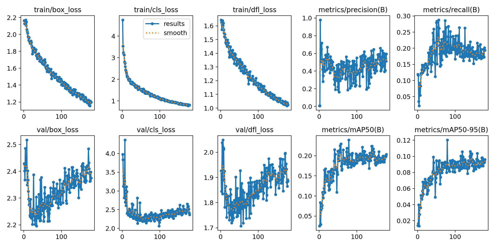

# Road Objects Tracking System with YOLOv8

This project demonstrates an object-tracking system using YOLOv8 for detection and a Kalman filter for tracking. The system is designed to detect and track objects in a video stream.

## Table of Contents

- [Project Structure](#project-structure)
- [Installation](#installation)
- [Training the Model](#training-the-model)
- [Custom Training Results](#custom-training-results)
- [Running the System](#running-the-system)
- [Dependencies](#dependencies)

## Project Structure

The project is organized into two main folders:

- **system**: Contains the main codebase for the object tracking system.
  - `detector_model_file`: Directory to store the trained YOLOv8 model weights.
  - `models`: Contains the implementation of various models used in the system (e.g., YOLOv8, Kalman filter).
  - `utils`: Contains utility functions and classes.
  - `detect.py`: Script to run the object detection and tracking on a video file.
  - `test.mp4`: Sample video file for testing the system.
  - `tracker.py`: Main script for the object tracking system.

- **training**: Contains the Jupyter notebook for training the YOLOv8 model.
  - `train.ipynb`: Jupyter notebook with the code for training the YOLOv8 model.
  - `runs/detect/train9/weights`: Directory where the trained model weights are saved.

## Installation

1. **Clone the repository:**
   ```bash
   git clone https://github.com/yourusername/your-repo.git
   cd your-repo
   ```
2. **Install the required dependencies:**
    Its upto you if you want to make a virtual environment, if yes then write following commands in the terminal:
    ```bash
    pip install virtualenv
    python -m virtualenv venv
    ./venv/Scripts/activate
    ```
    Install the requirements using following command
    ```bash
    pip install -r requirements.txt
    ```
## Training the Model

    In the training directory, we have jupyter notebook file which can be run cell wise to train the model. The weights will get trained and stored in runs/detect/train/weights/best.pt (model files will be present in the recent train folder which will be made with each train try)
    Copy the weights to system/detector_model_file/ and use this trained weights for detection.

## Custom Training Results
<div style="display: grid; grid-template-columns: repeat(2, 1fr); gap: 5px;">
  <div style="text-align: center;">
    <div><strong>Confusion Matrix</strong></div>
    
  </div>
  <div style="text-align: center;">
    <div><strong>Labels Correlogram</strong></div>
    
  </div>
  <div style="text-align: center;">
    <div><strong>P Curve</strong></div>
    
  </div>
  <div style="text-align: center;">
    <div><strong>R Curve</strong></div>
    
  </div>
  <div style="text-align: center;">
    <div><strong>PR Curve</strong></div>
    
  </div>
  <div style="text-align: center;">
    <div><strong>Results</strong></div>
    
  </div>
</div>

## Running the System

1. **Navigate to the system directory:**
    ```bash
    cd ../system
    ```
2. **Run the detection and tracking script:**
    ```bash
    python detect.py
    ```
3. The script will process the test.mp4 video file and display the results with bounding boxes and tracking IDs.

## Dependencies

The project requires the following dependencies, which are listed in requirements.txt:

- ultralytics
- opencv-python
- numpy
- torch
- torchvision

Ensure all dependencies are installed by running:
    ```
    pip install -r requirements.txt
    ```
## License
This project is licensed under the MIT License. See the LICENSE file for details.

## Acknowledgments
Thanks to the YOLOv8 and Ultralytics teams for their excellent work on the YOLO object detection framework.

Thanks to the OpenCV community for their powerful computer vision library.

Feel free to contribute to this project by submitting issues or pull requests.

